<!-- Header animado -->
<div align="center">
  
</div>

<!-- Typing SVG -->
<div align="center">
<a href="https://git.io/typing-svg"></a>
</div>

<br>

<!-- About Section com badges animados -->
<div align="center">
  
  
  
</div>

<br>

<!-- Bio Section -->
<div align="left">

```rust
struct Developer {
    name: &'static str,
    current_focus: Vec<&'static str>,
    location: &'static str,
    email: &'static str,
}

impl Developer {
    fn new() -> Self {
        Developer {
            name: "Tiago",
            current_focus: vec![
                "🦀 Mastering Rust",
                "⚡ Building high-performance applications",
                "🔧 Systems programming",
                "🌐 WebAssembly projects",
            ],
            location: "Brazil 🇧🇷",
            email: "tl.dev@outlook.com",
        }
    }
    
    fn current_status(&self) -> &str {
        "Transitioning to Rust Developer 🚀"
    }
}

fn main() {
    let tiago = Developer::new();
    println!("Status: {}", tiago.current_status());
}
```

</div>

<br>

<!-- Tech Stack Section -->
<h2 align="left">
  
  Tech Arsenal
</h2>

<details open>
<summary><b>🦀 Rust Ecosystem (Primary Focus)</b></summary>
<br>
<div align="left">
  
  
  
  
  
</div>
</details>

<details>
<summary><b>🎯 Backend Proficiencies</b></summary>
<br>
<div align="left">
  
  
  
  
  
  
</div>
</details>

<details>
<summary><b>⚛️ Frontend Technologies</b></summary>
<br>
<div align="left">
  
  
  
  
  
  
  
  
  
</div>
</details>

<details>
<summary><b>🛠️ DevOps & Tools</b></summary>
<br>
<div align="left">
  
  
  
  
  
</div>
</details>

<details>
<summary><b>🗄️ Databases</b></summary>
<br>
<div align="left">
  
  
  
  
</div>
</details>

<br>

<!-- Current Learning Path -->
<h2 align="left">
  
  Rust Learning Journey

```mermaid
graph LR
    A[Rust Fundamentals] -->|✅| B[Ownership & Borrowing]
    B -->|🔄| C[Error Handling & Testing]
    C -->|📚| D[Async Programming]
    D -->|🎯| E[Web Development with Actix/Rocket]
    E -->|🚀| F[Systems Programming]
    F -->|⚡| G[WebAssembly]
    
    style A fill:#2e7d32
    style B fill:#388e3c
    style C fill:#43a047
    style D fill:#66bb6a
    style E fill:#81c784
    style F fill:#a5d6a7
    style G fill:#c8e6c9
```

</h2>



<br>

<!-- GitHub Stats com tema dark -->
<h2 align="left">
  
  GitHub Analytics
</h2>

<div align="center">
  
  
</div>

<div align="center">
  
</div>

<!-- Activity Graph -->
<div align="center">
  
</div>

<br>

<!-- Projects Section -->
<h2 align="left">
  
  Featured Projects
</h2>

<div align="center">
  <table>
    <tr>
      <td align="center" width="50%">
        
        <br><br>
        
        <br>
        <p><b>Building something amazing...</b></p>
      </td>
      <td align="center" width="50%">
        
        <br><br>
        
        <br>
        <p><b>Performance-focused project</b></p>
      </td>
    </tr>
  </table>
</div>

<div align="center">
  <br>
<a href="https://git.io/typing-svg"></a>
</div>

<br>

<!-- Connect Section -->
<h2 align="left">
  
  Let's Connect
</h2>

<div align="left">
  <a href="mailto:tl.dev@outlook.com">
    
  </a>
  <a href="https://github.com/meee3">
    
  </a>
  <a href="https://linkedin.com/in/seu-linkedin">
    
  </a>
</div>

<br>

<!-- Profile Views Counter -->
<div align="center">
  
</div>

<!-- Footer -->
<div align="center">
  
</div>

<!-- Snake animation -->
<div align="center">
  <picture>
    <source media="(prefers-color-scheme: dark)" srcset="https://raw.githubusercontent.com/platane/snk/output/github-contribution-grid-snake-dark.svg">
    <source media="(prefers-color-scheme: light)" srcset="https://raw.githubusercontent.com/platane/snk/output/github-contribution-grid-snake.svg">
    
  </picture>
</div>
